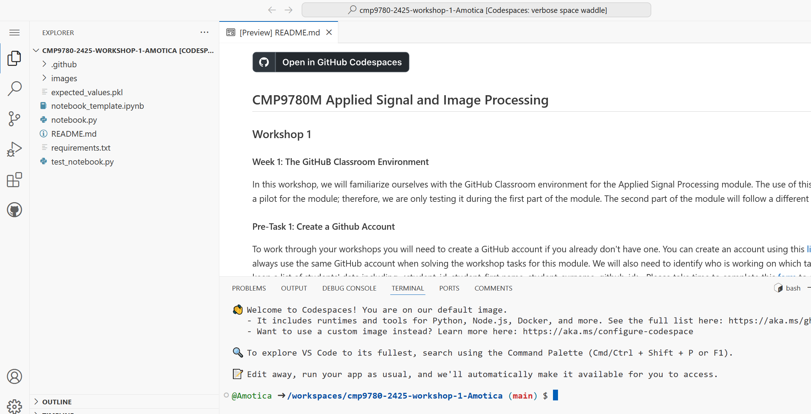
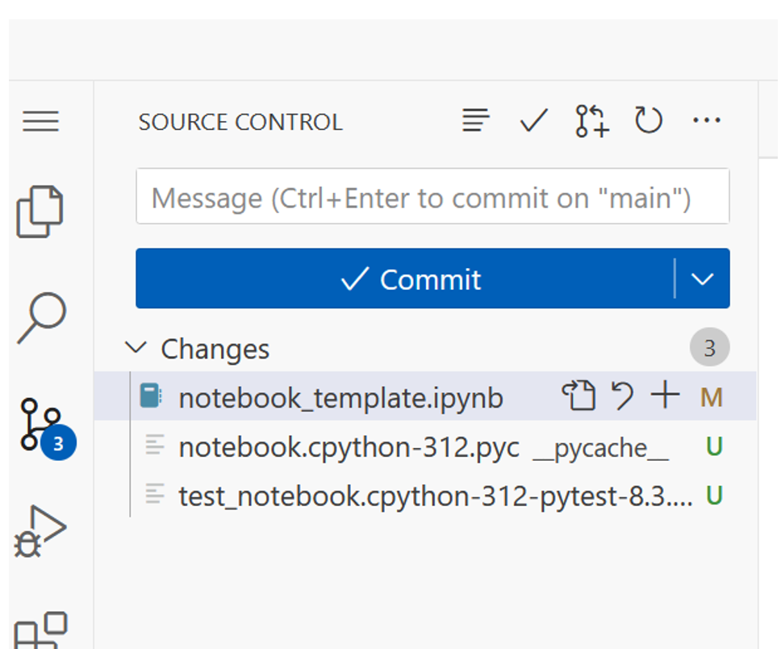

## **CMP9780M** Applied Signal and Image Processing, **EGR3031** Signal Processing and System Identification. and **BME3002** Biomedical Imaging and Signal Processing 
#### Week 1: Working Within the GitHuB Classroom Environment

In this workshop, we will familiarise ourselves with the GitHub Classroom environment for this module. The use of this environment is the second stage pilot for the module workshop; therefore, we are only using this for all signal processing, but some parts of image processing. Other parts of the image processing will follow a slightly different format. At the end of the module, we will collect feedback on the entire module to help decide whether to continue using GitHub Classroom in the future (this has proved popular last year!).

#### Pre-Task 1: Create a Github Account

To work through your workshops you will need to create a GitHub account if you already don't have one. You can create an account using this [link](https://github.com/signup). You **MUST** always use the same GitHub account when solving the workshop tasks for this module. We will also need to identify who is working on which tasks. So we shall keep a list of students' data including  <student_id, student_first name, student_surname, github_id>. Please take time to complete this form [!link] to supply these details. Please also ensure that you submit your workshop codes using the same GitHub account each time.

#### Pre-Task 2: Setup coding environment

  1. Access the Workshop environment at the following [link]([images/access_workshop_greetings.PNG](https://github.com/user-attachments/assets/a8e5e4cd-0ed0-433f-baef-931306a6424a)). You will be greeted by the following message, and you need to accept the assignment.
     
  3. After having accepted the new assignment, please open your development environment by clicking on the black button ("Open in GitHub Codespaces"))
     
  5. After some loading time, an instance of Visual Studio Code should be visible within your browser, similarly to what you can see in the following image
     
  7. (Optional) If you are already familiar with VS Code and you have linked it to your GitHub account previously, you may log in to synchronise your own settings and extension.

#### Main Task: Create a Signal and Plot it

As the first task for this module, you need to implement a very simple Jupyter notebook script for a **Signal, S**. **S** has a Sample frequency (**Fs**) = 210, you could estimate the period **T**, using the relation `T = 1/ Fs`. The signal length (**L**) = 2 seconds, the amplitude of the signal (**A**) = 0.9, and the signal’s frequency (**ω**) = 15. The sample period (**dt**) should be expressed in terms of the sample Frequency. Write down the relation to represent the sinusoid of this signal and plot it.

**Instructions:**

  1. You should find the `notebook_template.ipynb` file in the Visual Studio Code Explorer window. Double click to open it.
  3. Select the Kernel to run the notebook.
     
  5. Modify the **code cells** in the `notebook_template.ipynb`. To create and display the signal without changing the supplied variable names. This will help your test to pass as the test script relies on the variable names.
  6. Run scripts as you work through the Notebook (by running all or individual code cell)
  7. Once you are happy with you codes, it is time to test scripts to ensure correctness before pushing to the cloud.
  8. Use the test_notebook.py file to test your solution. Please do not modify these codes.
  9. Open test_notebook.py file and the select the run button at the top right of the window that appears and select Run Python file in terminal. Alternatively, right click the any part of the document and select “Run Python -> Run Python file in terminal.
      
  
#### Post-Task: Submit your solution

  1. Submit Your solution: When you are happy with your solution, it's now time to submit it online for being graded. You may see on the left an icon looking like a tree with a badge on it. Clicking on it will open a side menu for performing version control on our project:
     
  3. At this point, we want to commit the modification we made to the file hello_world.cpp. As such, click on the + symbol appearing when you hover with your mouse on this file. By doing so, we will add the hello_world.cpp file to the list of files staged for commit:
     
  4. We now need to specify a message for our commit. It must be anything informative about what we have done. You can simply type "Solution" in the text box and then press the green button. You should see now there are some files that need to be syncronised between our project and the remote:
     
  5. Actions:

